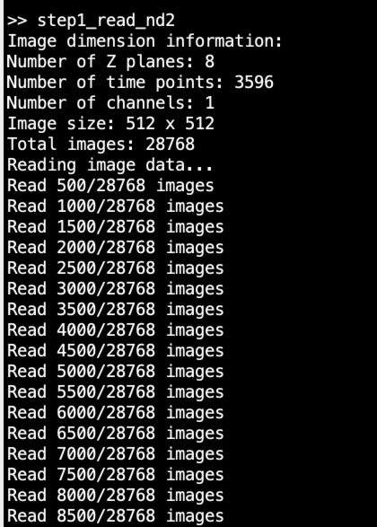
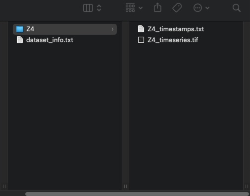

# Step 1: Read the .nd2 file

This step uses the MATLAB script [`step1_read_nd2.m`](https://github.com/qingruiliu/data_processing_Ukanazawa/blob/main/2P_data_processing_MATLAB/step1_read_nd2.m) to process .nd2 files.

---

## Description

This script performs the following tasks:

- Directly reads `.nd2` files in MATLAB
- Automatically saves `.tif` image sequences and `.txt` timestamps for all or individual imaging planes
- Prepares files for the next step (**suite2p** input)

---

## Dependencies

Before using this script, you need to install:

- **OME Bio-formats Toolbox for MATLAB** - [Download here](https://www.openmicroscopy.org/bio-formats/downloads/)
- Download and add the functions to your MATLAB path

---

## How to Use

Follow these steps to process your .nd2 files:

### 1. Load the script

Load `step1_read_nd2.m` in MATLAB

### 2. Select input file

Select the target **resonant volume 2P** `.nd2` file

### 3. Reading process

MATLAB will read the `.nd2` images:

_MATLAB processing the .nd2 file_

### 4. Save options

When finished reading the `.nd2` file, a window will ask how to save the files:

_Choose your saving preferences_

Available options:

- **Yes**: Save all planes
- **Select specific planes**: Choose only certain planes to save

### 5. Select output location

Choose where to save the processed files

### 6. Review output

Check the generated files:

_Generated output files_

---

## Output Files

The script generates the following files:

| File Type          | Description                                          |
| ------------------ | ---------------------------------------------------- |
| `dataset_info.txt` | MATLAB log from the command window                   |
| `*_timestamps.txt` | Timestamp for each frame of the image sequence       |
| `*_timeseries.tif` | 8-bit grayscale image sequence for **suite2p** input |
