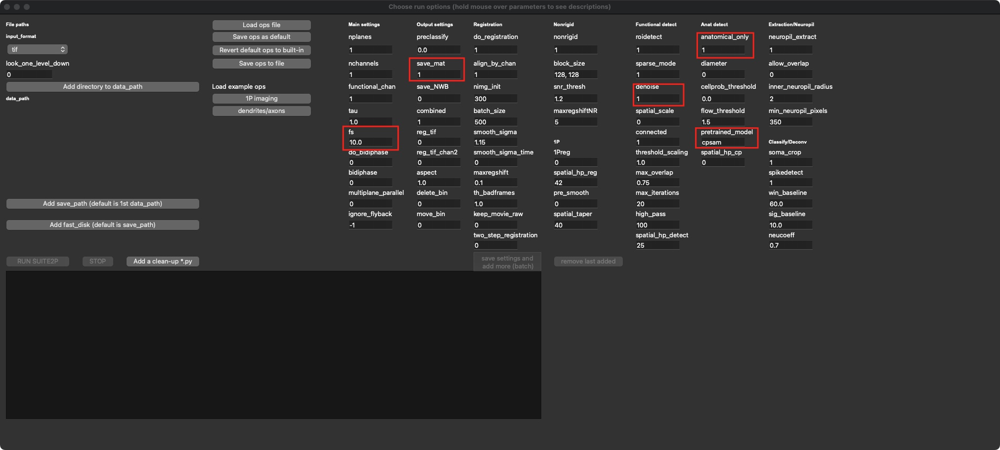

# 2. Suite2p for registration, ROI detection and spike detection

## Description

## Dependency

- python virtual environment (managed by anaconda) with **suite2p** installed
- **cellpose** installed in the same environment is recommended (for better cell segmentation)

## How to use

### input

- Open suite2p through your command window

```
$ conda activate your-suite2p-environment
$ python -m suite2p
```

- File --> Run suite2P
- `Add directory to data_path` and choose the folder containing image sequence
- Adjust the necessary settings:



- **fs:** imaging frequency (input your actual frequency)
- **save_mat:** output .mat file
- **denoise:** denoise the image using PCA
- **anatomical_only:** 1 is recommended
- **pretrained_model:** `cpsam` (if cellpose installed), `cyto2`

### output

## More info

- check https://suite2p.readthedocs.io/en/latest/settings.html
