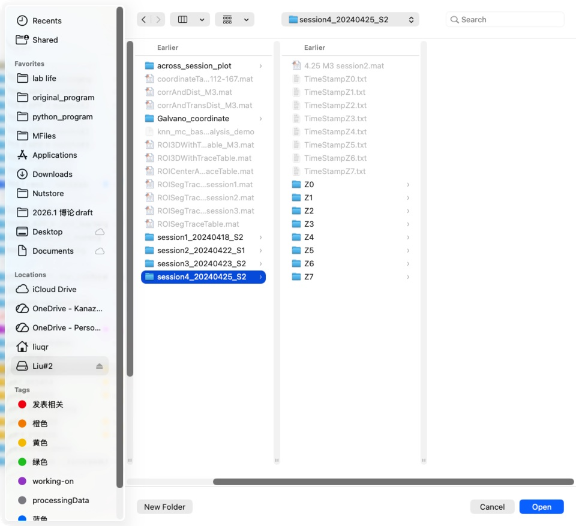
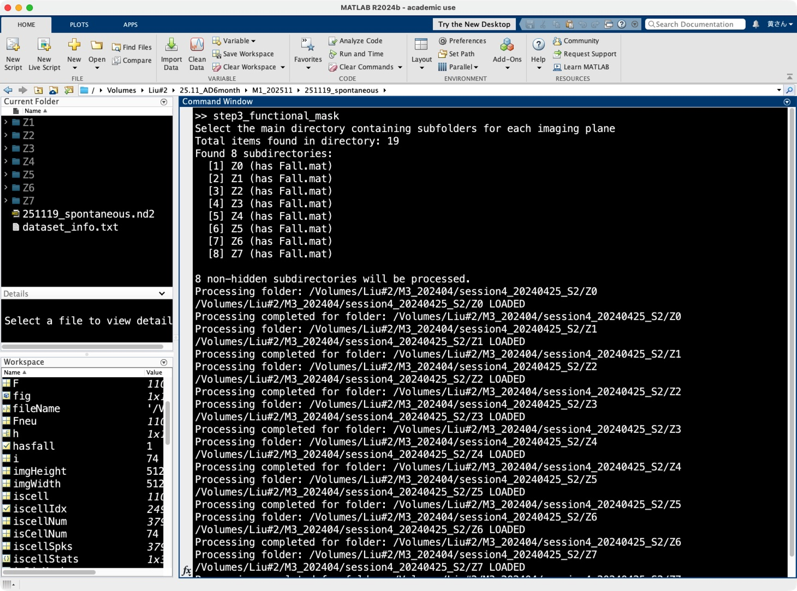
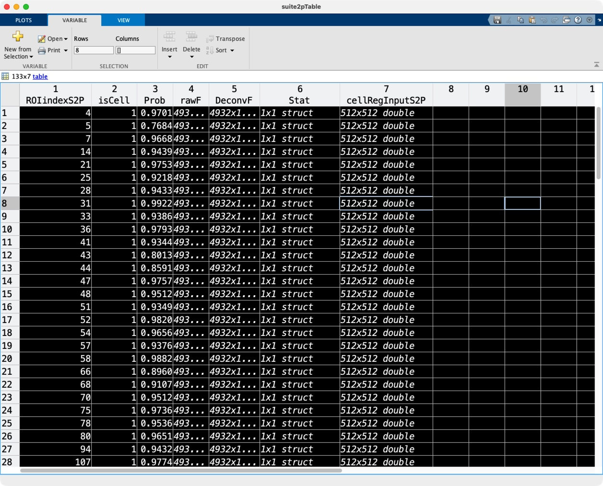

# Step 3: Functional Masks

This step involves processing the output from **Suite2p** (Step 2) to organize ROI data and generate functional masks required for cross-session registration (CellReg).

## MATLAB Script

**Script Name:** `step3_functional_mask.m`

## Overview

The script iterates through the output folders of Suite2p (one per imaging plane), processes the `Fall.mat` file, and generates standardized MATLAB tables and binary mask files. It prepares the data for both data analysis and anatomical registration.

## Usage

1.  Run the script `step3_functional_mask.m` in MATLAB.
2.  A dialog box will appear asking you to **"Select the main directory containing subfolders for each imaging plane"**.
3.  Select the parent folder containing your Suite2p output folders (e.g., `suite2p/plane0`, `suite2p/plane1`).

- select the parent folder:
  

4.  The script will automatically process all subdirectories found that contain a `Fall.mat` file.

## Processing Steps

The script performs the following operations for each plane:

1.  **Load Data**: Loads the `Fall.mat` file generated by Suite2p, containing ROI statistics (`stat`), fluorescence traces (`F`), deconvolved spikes (`spks`), and cell classification (`iscell`).
2.  **Data Organization**:
    - Creates a table `suite2pTable` storing indices, cell classification, cell probabilities, raw fluorescence, deconvolved activity, and spatial statistics.
    - Normalizes the pixel contribution (Lambda) for each ROI to create spatial footprints.
3.  **Visualization**:
    - Generates a "Spatial footprint" image showing the location of all detected cells (`isCell == 1`).
    - Saves this as both `.png` and `.tif` images.
4.  **CellReg Preparation**:
    - Extracts spatial masks for accepted cells.
    - Converts them into a 3D binary matrix (Height x Width x N_Cells).
    - Permutes dimensions to match **CellReg** requirements.

- MATLAB command output:
  

## Output Files

For each processed plane folder, the following files are generated:

| File Name                       | Description                                                                                                                                                               |
| :------------------------------ | :------------------------------------------------------------------------------------------------------------------------------------------------------------------------ |
| `suite2pTable.mat`              | A MATLAB table containing aligned ROI data, including raw traces (`rawF`), deconvolved activity (`DeconvF`), coordinates (`Stat`), and spatial masks (`cellRegInputS2P`). |
| `suite2p_spatial_footprint.png` | A visualization of the spatial footprint of all accepted cells (isCell=1).                                                                                                |
| `suite2p_spatial_footprint.tif` | A TIFF version of the spatial footprint, normalized.                                                                                                                      |
| `cellRegInput.mat`              | A `.mat` file containing the variable `cellRegInput`. This is a 3D binary mask (Height x Width x N_Cells) used as input for **CellReg**.                                  |

- suite2pTable:
  

### Key Variables in `suite2pTable`

- **ROIindexS2P**: Original ROI index from Suite2p.
- **isCell**: Classification result (1 if classified as a cell, 0 otherwise).
- **Prob**: Probability of being a cell.
- **rawF**: Raw fluorescence trace.
- **DeconvF**: Deconvolved neural activity (spikes).
- **Stat**: Spatial statistics structure from Suite2p.
- **cellRegInputS2P**: 3D spatial mask for the individual ROI.

### cellRegInput: input matrix for the cellReg input for **across-session registration**

- cellRegInput:
  
